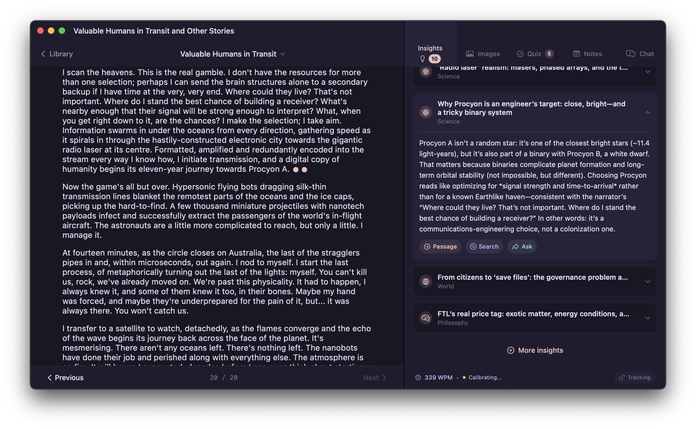
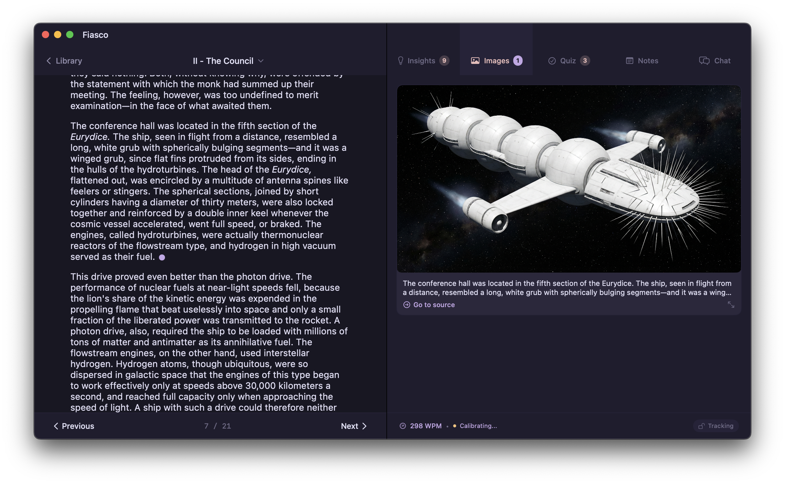

# Reverie

A macOS book reader that shows you interesting things while you read.


*Screenshot from qntm's "Valuable Humans in Transit"*

## Install

Download the latest release from the [Releases](../../releases) page. Unzip and drag to Applications.

## The Problem

Books contain more than what's on the page. A novel mentions a historical battle—there's real history behind it. A character quotes a philosopher—there's a whole tradition there. Science fiction invokes physics—sometimes it's real, sometimes it's not. You could stop reading and look it up. You won't.

## The Solution

Reverie watches what you're reading and surfaces the knowledge you'd never search for. Not summaries. Not "this chapter explores themes of identity." Actual information: the real science behind the fiction, the historical events that inspired the narrative, connections to other works you might know, philosophical traditions the author is drawing from.

You scroll. Everything else follows. Insights appear anchored to the passage they illuminate. Footnotes surface when you reach them. Images generate for scenes worth visualizing. The right panel stays synchronized with where you are—you never navigate, search, or manage anything. Just read.

## How It Works

Import an EPUB. Start reading. As you progress through chapters, Reverie processes each one with AI to extract:

- **Science & Engineering** — Real physics, biology, chemistry that illuminate or contradict the text
- **History** — Actual events, figures, and periods connected to the narrative
- **Philosophy** — Named thought experiments, specific thinkers, traditions being referenced
- **Connections** — Links to other literature, mythology, art, and cultural works
- **World** — In-universe logic and unstated implications worth noticing

Insights appear in the right panel, linked to specific passages. Click one, jump to that part of the text. Keep reading.

You finish a book. A week later, you barely remember it—some vague impressions, a character's name, maybe the ending. Reverie generates quiz questions for each chapter: not plot trivia, but questions about causality, implications, and the ideas behind the story. Active recall while it's fresh. Optional, but there if you want to actually retain what you read.

## Images

You're reading a sci-fi novel. A passage describes a spacecraft in vivid detail—its hull geometry, the way it catches starlight, the scale of it against the void. You try to picture it, and you get something—but it's vague, abstract, half-formed.

Reverie recognizes visual moments automatically. When a scene is worth seeing, it generates an image and shows it to you—in the same panel, synchronized to your scroll position, alongside everything else. You keep reading. The ship appears when you get there.


*Screenshot from Stanisław Lem's "Fiasco"*

## Footnotes

EPUBs often bury footnotes at the end of the book or hide them behind inconvenient links. Reverie extracts them and surfaces each one when you reach the reference, in context, without leaving the page.

## Going Deeper

Sometimes an insight sparks a question. You want to know more about that historical event, or you're curious whether the author got the physics right, or you want to explore a philosophical concept further.

The chat panel lets you ask anything—about the book, the current chapter, or a specific insight. It knows what you're reading and where you are. If you want to pull in current information, web search is built in. Click an insight to research it further, or just ask a question and let Reverie find the answer.

## What Reverie Is Not

- Not a summary tool. Insights are about what's behind the text, not what's in it.
- Not trying to replace reading with AI-generated content.

Reverie assumes you want to read the book. It just makes sure you don't miss the interesting parts hiding beneath the surface.

## Theming

Ships with Rose Pine. The theme system is just a color palette—swap it to match your terminal or editor in seconds.

## Requirements

- macOS 15+
- API key for Gemini, OpenAI, or Anthropic (just one is enough)

Insight quality depends entirely on the model. Stronger models produce deeper, more specific insights; weaker models produce generic observations. The default configuration uses the best available models—if you downgrade for cost, expect the results to reflect that.

## Building

```
swift build
swift test
```

## Contributing

This project was vibe-coded with Claude Code, Codex, and Gemini CLI. Contributions are welcome.

The only thing that matters is **insight quality** and the reading experience. If you want to contribute, focus on that—better prompts, smarter extraction, smoother UX. Bug fixes are always welcome. Random features that don't serve the core experience are not.
